# test_fiesta.cpp阅读笔记

```bash
# 每个新窗口记得source ros和catkin_ws
source /opt/ros/melodic/setup.bash && source /home/yutou/catkin_ws/devel/setup.bash
# 窗口1 运行主体
roslaunch fiesta cow_and_lady.launch
# 窗口2 运行rosbag
rosbag play ./rosbag/data.bag

```


\* `HASH_TABLE` is disabled in `include/parameters.h`  


## `include/Fiesta.h`

`Fiesta<DepthMsgType, PoseMsgType>::Fiesta(ros::NodeHandle node)`

- 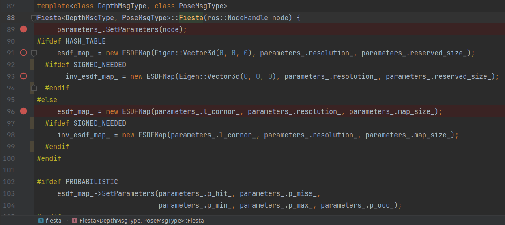
- 设置参数
- 初始化esdf_map  [ESDFMap](#ESDFMap)
- 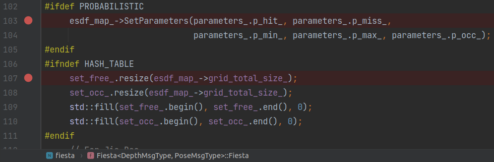
- 设置概率参数
  - logit(p) = log(x / (1 - x))
- (array模式)初始化set_free\_, set\_occ\_ 储存空间, 赋值为0-free
- 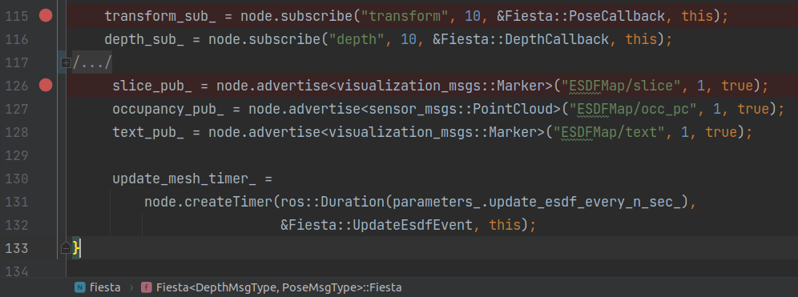
- subscribe topics
  - transform 位姿 [PoseCallback()](#PoseCallback)
  - depth 深度/点云 [DepthCallback()](#DepthCallback)
- publish topics
  - slice
  - occupancy
  - text
- 定时循环运行 [UpdateEsdfEvent()](#UpdateEsdfEvent)


`void Fiesta<DepthMsgType, PoseMsgType>::PoseCallback(const PoseMsgType &msg)`<a name=PoseCallback></a>

- 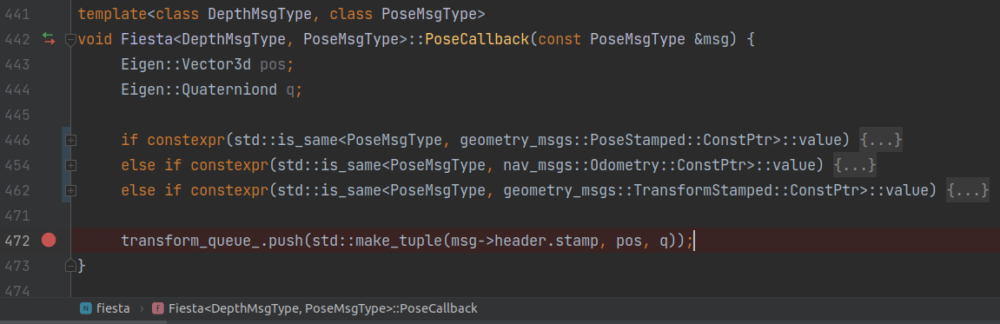
- 把 (时间戳, 位置, 姿态) 加入transform_queue_
  - 后续的处理在[SynchronizationAndProcess()](#SynchronizationAndProcess)


`void Fiesta<DepthMsgType, PoseMsgType>::DepthCallback(const DepthMsgType &depth_map)`<a name=DepthCallback></a>

- 把 深度图 加入depth_queue_
- [SynchronizationAndProcess()](#SynchronizationAndProcess)


`void Fiesta<DepthMsgType, PoseMsgType>::SynchronizationAndProcess()`<a name=SynchronizationAndProcess></a>

当depth_queue_还有深度图时

- *指示flag* new_pos = false
- depth_time 深度队列里的第一个深度图的时间戳
- 找到transform_queue_里时间戳最接近的msg
  - if 时间戳 <= depth_time + ros::Duration(time_delay)
  - 记录位置和姿态, new_pos = True
  - 从队列里pop掉
  - 直到队列清空或时间戳大于 ...(上面时间)
- 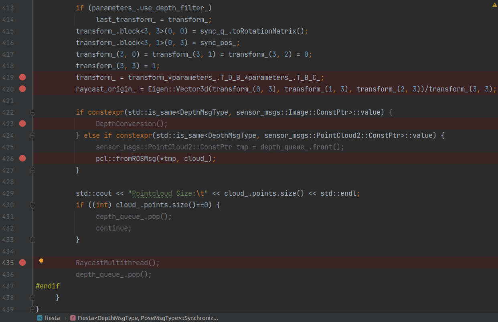
- transform_ 投影矩阵 深度图坐标系->机体->相机
- raycast_origin_  原点
- 如果是深度图
  - 每个点投影到相机(?)坐标系 形成 点云
  - 如果parameters\_.use\_depth\_filter\_
    - 忽略靠近图像边缘的点
    - 每个点重投影到上一张图像比较深度差距, 忽略大于阈值的点
- 如果是点云
  - 从ROSMsg转换成pcl点云
- 进行raycast [RaycastMultithread()](#RaycastMultithread)


`void Fiesta<DepthMsgType, PoseMsgType>::RaycastMultithread()`<a name=RaycastMultithread></a>

- parameters\_.ray\_cast\_num\_thread_==0
  - 单线程处理 [RaycastProcess()](#RaycastProcess)
- parameters\_.ray_cast_num_thread_ > 0
  - 多线程处理 [RaycastProcess()](#RaycastProcess)
  - 修改launch中的参数, 程序出错, **\*TODO\***


`void Fiesta<DepthMsgType, PoseMsgType>::RaycastProcess(int i, int part, int tt)`<a name=RaycastProcess></a>

- 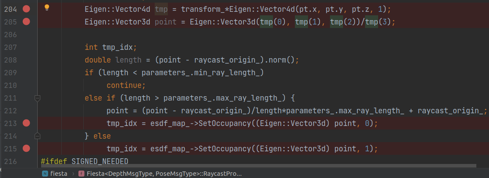
- 对于点云里的每一个点:
  - 转换到世界坐标系
  - 如果超出ray最长距离, 截断到最长距离
    - 只考虑最长距离, 也就是到视线极限仍然是空
    - tmp_idx = esdf_map_->[SetOccupancy(pos, 0)](#SetOccupancy_pos) 设置为0 - free
  - tmp_idx = esdf_map_->[SetOccupancy(pos, 1)](#SetOccupancy_pos) 设置为1 - occupy
  - 设置set_occ_对应的tmp_idx
    - (HASH_TABLE) `set_occ_.insert(tmp_idx)`
    - (ARRAY) `set_occ_[tmp_idx] = tt`
  - 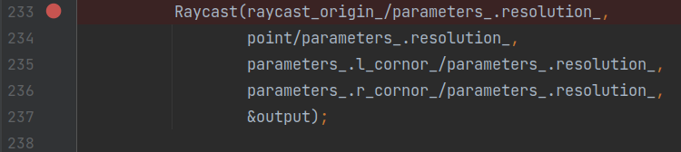
  - output是光线经过的所有格子的坐标
  - 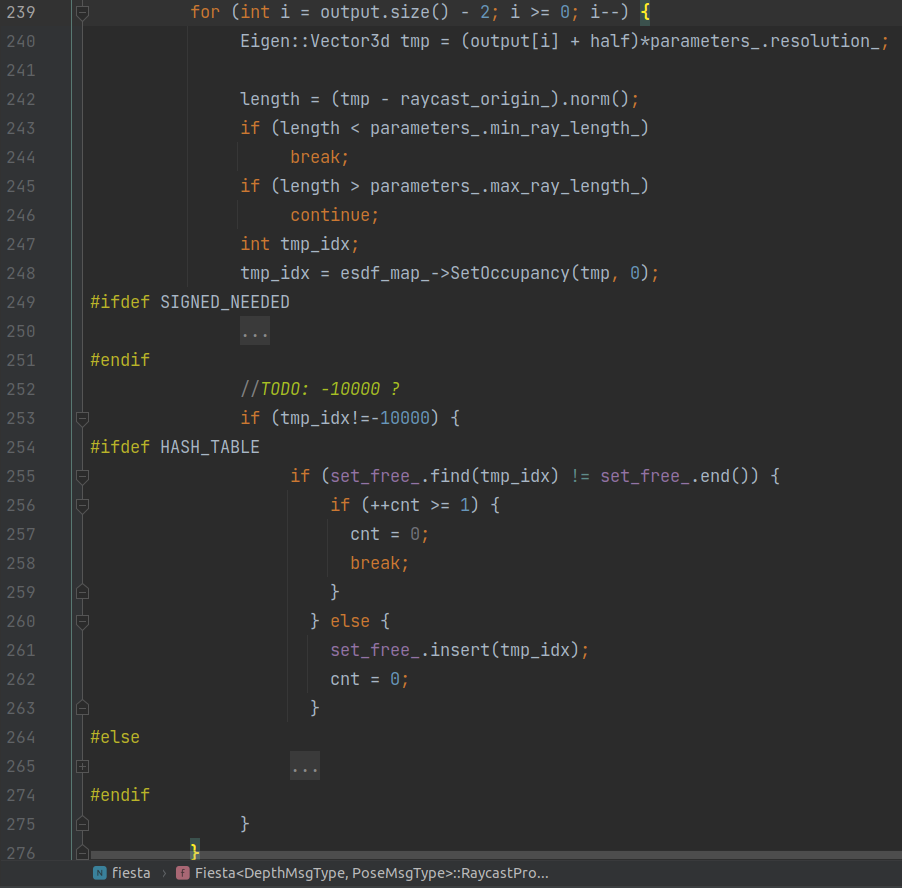
  - 对于output中的每一个格子坐标(int), 从最远的开始:
    - tmp 计算格子中心点坐标(double)
    - length 到光心的距离
      - 用于判断点是否落在min_ray_length和max_ray_length范围内
    - `tmp_idx = esdf_map_->SetOccupancy(tmp, 0)` 该处occupancy状态设置为0-free
    - 如果tmp_idx已经在set_free_存在
      - 说明后面坐标都已经raycast过了
      - break


`void Fiesta<DepthMsgType, PoseMsgType>::UpdateEsdfEvent(const ros::TimerEvent & /*event*/)`<a name=UpdateEsdfEvent></a>

- cur_pos_ = sync_pos_ 
- 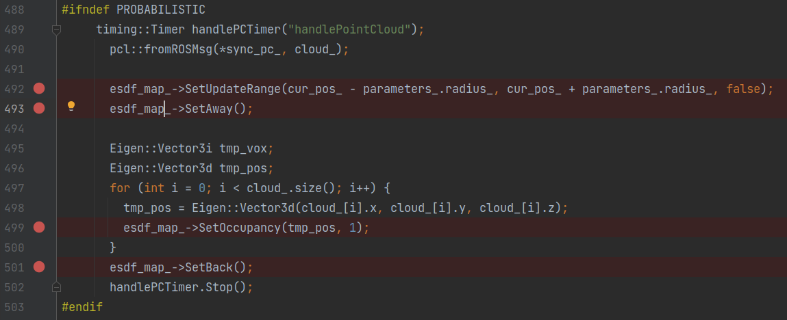
- [SetUpdateRange()](#SetUpdateRange) 把更新范围设置为 `cur_pos_` $\pm$ `parameters_.radius_` 
- [SetAway()](#SetAway) 把更新范围内的点的occupancy_buffer_值 暂时改成2~3
- 对于点云内的点:
  - 设置为1-occupied [SetOccupancy()](#SetOccupancy_pos)
- [SetBack()](#SetBack) 把更新范围内的点的occupancy_buffer_值 设为0-free
  - cur_pos也就是相机的位置, 附近空间理论上是0-free的
- 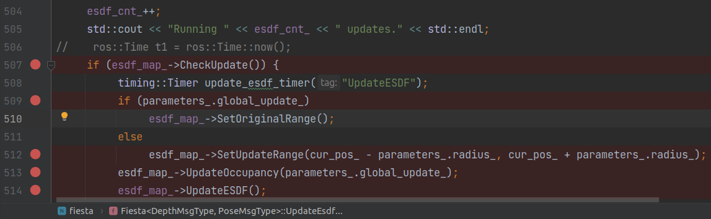
- [CheckUpdate()](#CheckUpdate) 检查occupancy_queue_队列是否为空
- 如果全局更新`parameters_.global_update_`, [SetOriginalRange()](#SetOriginalRange)
- 否则[SetUpdateRange()](#SetUpdateRange) 把更新范围设置为 `cur_pos_` $\pm$ `parameters_.radius_` 
- 更新地图 occupancy状态 [UpdateOccupancy()](#UpdateOccupancy)
- 更新地图 距离 [UpdateESDF()](#UpdateESDF)


## src/ESDFMap.cpp

`fiesta::ESDFMap::ESDFMap(...)`<a name=ESDFMap></a>

array模式

- 输入: Eigen::Vector3d origin 中心, double resolution_ 分辨率, Eigen::Vector3d map_size 地图大小
- 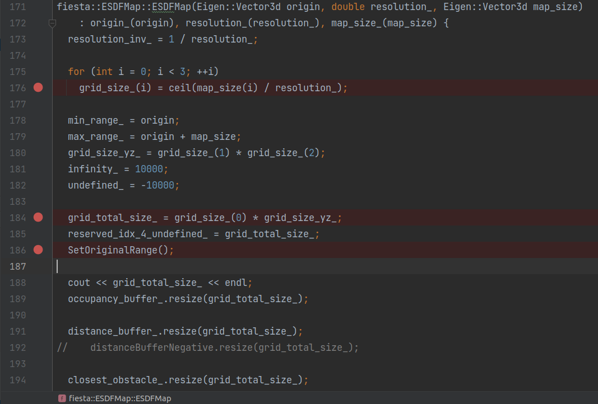
  - 计算grid_size
  - grid_size_yz_ 用途待定
  - [SetOriginalRange()](#SetOriginalRange)
    - 初始化地图范围, 用min_vec\_和max_vec\_表示
- 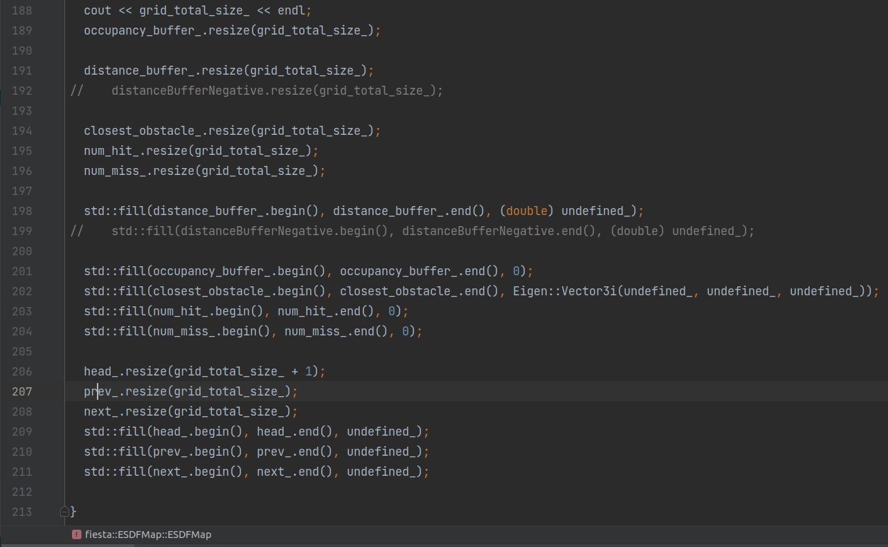
  - 初始化并赋值
    - occupancy_buffer_	<-0-free
    - 距离distance_buffer_ <-undefined_
    - 最近障碍物坐标closest_obstacle_ <-undefined\_, undefined\_, undefined\_
    - num_hit\_, num_miss_ <-undefined_
    - head_ 多一个size <-undefined_
    - prev\_, next\_ <-undefined_

HASH_TABLE模式

- *****\*TODO\******


`int fiesta::ESDFMap::SetOccupancy(Eigen::Vector3d pos, int occ)`<a name=SetOccupancy_pos></a>

- `Pos2Vox(pos, vox)` pos转换成vox
- return [SetOccupancy(vox, occ)](#SetOccupancy_vox)


`int fiesta::ESDFMap::SetOccupancy(Eigen::Vector3i vox, int occ)` <a name=SetOccupancy_vox></a>

- `idx = Vox2Idx(vox)` vox转换成idx
- 如果vox在地图内
- 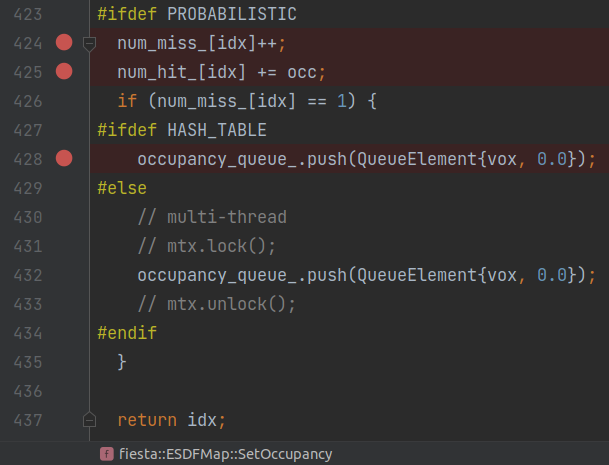
  - 只要光线穿过num_miss_就加一
  - num_hit_ 加上occ (0-free, 1-occupied)
- 只被光线穿过一次的
  - （vox, 0.0）加入occupancy_queue_队列
    - 后续的处理在 [UpdateOccupancy()](#UpdateOccupancy)


`bool fiesta::ESDFMap::UpdateOccupancy(bool global_map)`<a name=UpdateOccupancy></a>

- 当occupancy_queue_队列里还有元素时:

- 取出元素xx

- idx: 体素xx.point_对应的index

- occupy: 是否占据 0或1

  - 概率是连续数值 >min_occupancy_log_ 
  - 是或否, 值为1

- log_odds_update

  - hit次数  >  miss-hit次数  : prob_hit_log_
  - 否则 : prob_miss_log_

- 如果distance_buffer_[idx] < 0:

  - 距离设为infinity_ (=10000)
  - InsertIntoList() 
    - reserved_idx_4_undefined_ (=0) 指向 idx 
    - **\*TODO\*** 具体解释

- 如果(`log_odds_update>=0`(occupied) 且`occupancy_buffer_[idx]`大于阈值clamp_max_log_, )或者

  ​		(`log_odds_update<=0`(free) 且`occupancy_buffer_[idx]`小于阈值clamp_min_log_)

  - 无需update, 下一个元素 continue

- 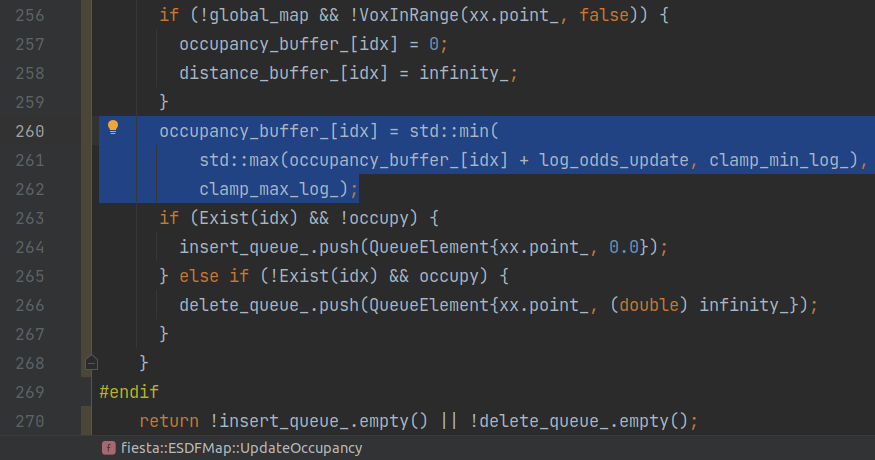

- 如果点不在局部地图里: 

  - `occupancy_buffer_[idx] = 0`
  - `distance_buffer_[idx] = infinity_`

- 更新occupancy_buffer_[idx]

  - 加上 log_odds_update
  - 限制在`(clamp_min_log_ , clamp_max_log_) `之间

- 如果现在Exist(idx)判断和更新之前的记录occupy不同:

  - 现在1, 之前0: 
    - `{xx.point_, 0.0}`加入insert_queue_   (这个vox是障碍物)
  - 现在0, 之前1:
    - `{xx.point_, (double) infinity_}`加入delete_queue_ (最近障碍物距离为无限远)

- return true当`insert_queue_`或`delete_queue_`有元素 (需要增减 *队列*?)


`void fiesta::ESDFMap::UpdateESDF()`<a name=UpdateESDF></a>


`void fiesta::ESDFMap::SetUpdateRange(Eigen::Vector3d min_pos, Eigen::Vector3d max_pos, bool new_vec)`<a name=SetUpdateRange></a>

- 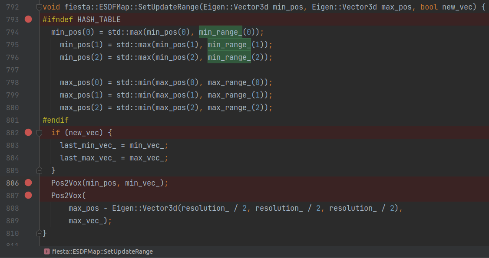
- 如果是HASH_TABLE, 确保min_pos和max_pos在 范围min_range\_, max\_range_之间
- 如果是new_vec,  last_min/max_vec_ 记录 上一个 min/max\_vec_ 
- min_vec_ 是 min_pos对应的voxel
- max_vec_ 是 (max_pos减去分辨率一半) 对应的voxel


`void SetAway()`<a name=SetAway></a>

- `SetAway(min_vec_, max_vec_)`
- 对于范围`min_vec_, max_vec_`之间的所有vox坐标:
  - 转换成idx
  - occupancy_buffer_中idx对应的值 与*2*取*逻辑或*
    - 0 变成 2
    - 1 变成 3
    - 2, 3 不变


`void SetBack()`<a name=SetBack></a>

- `SetBack(min_vec_, max_vec_)`
- 对于范围`min_vec_, max_vec_`之间的所有vox坐标:
  - 转换成idx
  - occupancy_buffer_中idx对应的值:
    - [SetOccupancy()](#SetOccupancy_vox) 赋值0-free


`void fiesta::ESDFMap::SetOriginalRange()`<a name=SetOriginalRange></a>

- 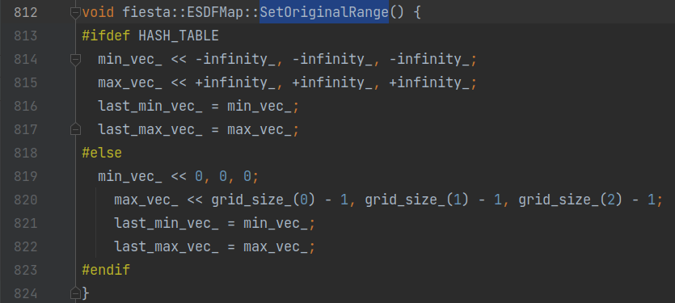
  - ​	初始化min_vec\_, max_vec\_ 和 last_min_vec\_, last_max_vec\_


`bool fiesta::ESDFMap::CheckUpdate()`<a name=CheckUpdate></a>

- 检查`occupancy_queue_`队列
  - 不为空 则return true
