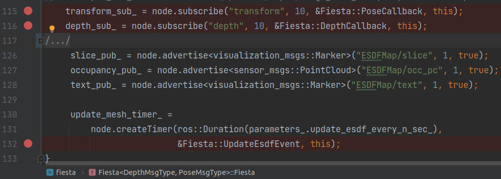

# test_fiesta.cpp阅读笔记

```bash
# 每个新窗口记得source ros和catkin_ws
source /opt/ros/melodic/setup.bash && source /home/yutou/catkin_ws/devel/setup.bash
# 窗口1 运行主体
roslaunch fiesta cow_and_lady.launch
# 窗口2 运行rosbag
rosbag play ./rosbag/data.bag

```


\* `HASH_TABLE` is disabled in `include/parameters.h`  


## `include/Fiesta.h`

`Fiesta<DepthMsgType, PoseMsgType>::Fiesta(ros::NodeHandle node)`

- 
- 设置参数
- 初始化esdf_map  [ESDFMap](#ESDFMap)
- 
- 设置概率参数
  - logit(p) = log(x / (1 - x))
- (array模式)初始化set_free\_, set\_occ\_ 储存空间, 赋值为0
- 
- subscribe topics
  - transform 位姿 [PoseCallback()](#PoseCallback)
  - depth 深度/点云 [DepthCallback()](#DepthCallback)
- publish topics
  - slice
  - occupancy
  - text


`void Fiesta<DepthMsgType, PoseMsgType>::PoseCallback(const PoseMsgType &msg)`<a name=PoseCallback></a>

- 
- 把 (时间戳, 位置, 姿态) 加入transform_queue_
  - 后续的处理在[SynchronizationAndProcess()](#SynchronizationAndProcess)


`void Fiesta<DepthMsgType, PoseMsgType>::DepthCallback(const DepthMsgType &depth_map)`<a name=DepthCallback></a>

- 把 深度图 加入depth_queue_
- [SynchronizationAndProcess()](#SynchronizationAndProcess)


`void Fiesta<DepthMsgType, PoseMsgType>::SynchronizationAndProcess()`<a name=SynchronizationAndProcess></a>

当depth_queue_还有深度图时

- *指示flag* new_pos = false
- depth_time 深度队列里的第一个深度图的时间戳
- 找到transform_queue_里时间戳最接近的msg
  - if 时间戳 <= depth_time + ros::Duration(time_delay)
  - 记录位置和姿态, new_pos = True
  - 从队列里pop掉
  - 直到队列清空或时间戳大于 ...(上面时间)
- 
- transform_ 投影矩阵 深度图坐标系->机体->相机
- raycast_origin_  原点
- 如果是深度图
  - 每个点投影到相机(?)坐标系 形成 点云
  - 如果parameters\_.use\_depth\_filter\_
    - 忽略靠近图像边缘的点
    - 每个点重投影到上一张图像比较深度差距, 忽略大于阈值的点
- 如果是点云
  - 从ROSMsg转换成pcl点云
- 进行raycast [RaycastMultithread()](#RaycastMultithread)


`void Fiesta<DepthMsgType, PoseMsgType>::RaycastMultithread()`<a name=RaycastMultithread></a>


## src/ESDFMap.cpp

### ESDFMap()<a name=ESDFMap></a>

array模式

- 输入: Eigen::Vector3d origin 中心, double resolution_ 分辨率, Eigen::Vector3d map_size 地图大小
- 
  - 计算grid_size
  - grid_size_yz_ 用途待定
  - SetOriginalRange()
  - 
    - ​	初始化最小, 最大vec 和 上一个最小, 最大vec
- 
  - 初始化并赋值
    - occupancy_buffer_	<-0
    - 距离distance_buffer_ <-undefined_
    - 最近障碍物坐标closest_obstacle_ <-undefined\_, undefined\_, undefined\_
    - num_hit\_, num_miss_ <-undefined_
    - head_ 多一个size <-undefined_
    - prev\_, next\_ <-undefined_

HASH_TABLE模式

- ***待续***
