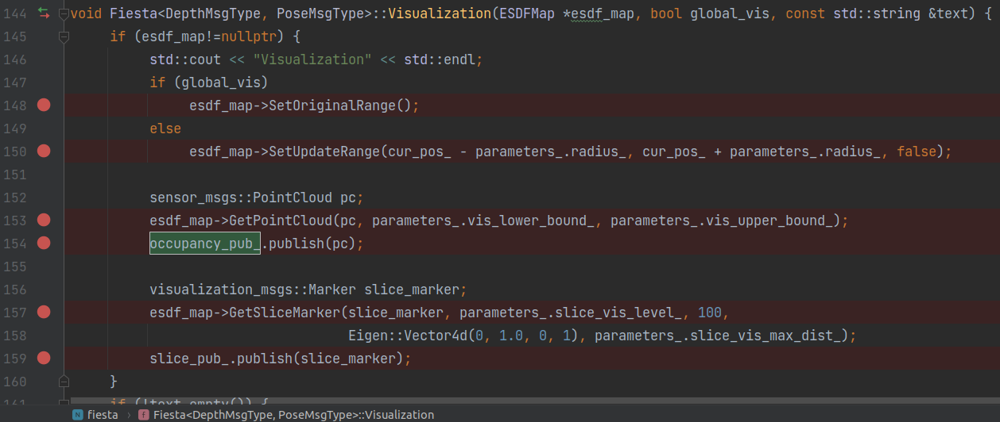
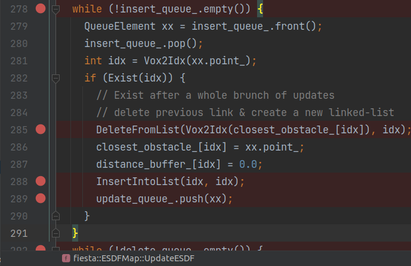
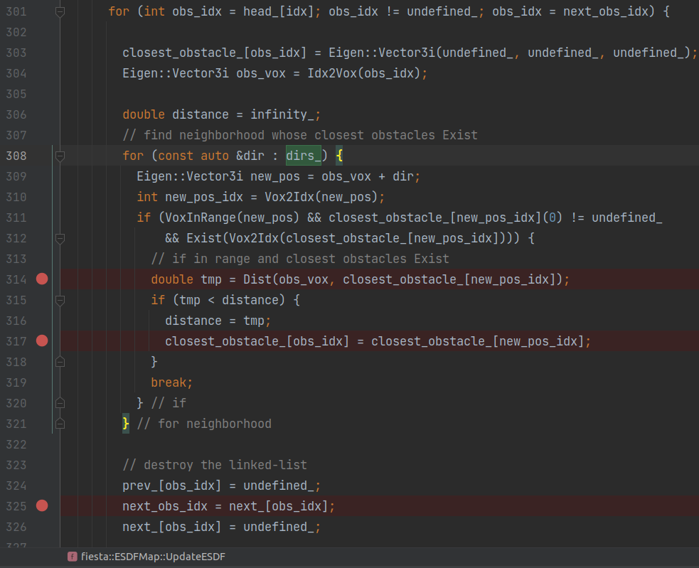
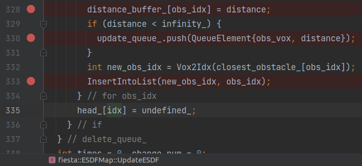
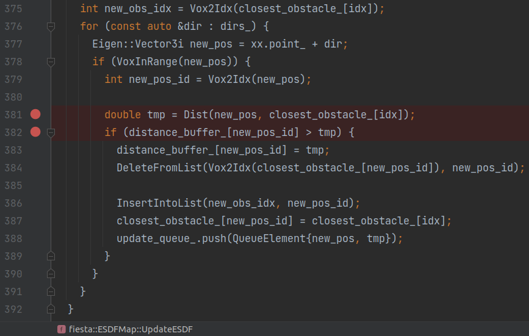

# test_fiesta.cpp阅读笔记

- ## 论文arXiv链接: https://arxiv.org/abs/1903.02144


```bash
# 每个新窗口记得source ros和catkin_ws
source /opt/ros/melodic/setup.bash && source /home/yutou/catkin_ws/devel/setup.bash
# 窗口1 运行主体
roslaunch fiesta cow_and_lady.launch
# 窗口2 运行rosbag
rosbag play ./rosbag/data.bag
```

<p> <a name=data_structure></a>


<em>数据结构示意图. 引自论文 Fig.3 </em>

</p>

<!--\* `HASH_TABLE` is disabled in `include/parameters.h`-->  


## `include/Fiesta.h`

### Fiesta()

`Fiesta<DepthMsgType, PoseMsgType>::Fiesta(ros::NodeHandle node)`

- 
- 设置参数
- 初始化esdf_map  [ESDFMap](#ESDFMap)
- 
- 设置概率参数
  - logit(p) = log(x / (1 - x))
- (array模式)初始化set_free\_, set\_occ\_ 储存空间, 赋值为0-free
- 
- subscribe topics
  - transform 位姿 [PoseCallback()](#PoseCallback)
  - depth 深度/点云 [DepthCallback()](#DepthCallback)
- publish topics
  - slice
  - occupancy
  - text
- 定时循环运行 [UpdateEsdfEvent()](#UpdateEsdfEvent)


### PoseCallback()<a name=PoseCallback></a>

`void Fiesta<DepthMsgType, PoseMsgType>::PoseCallback(const PoseMsgType &msg)`

- 
- 把 (时间戳, 位置, 姿态) 加入transform_queue_
  - 后续的处理在[SynchronizationAndProcess()](#SynchronizationAndProcess)


### DepthCallback()<a name=DepthCallback></a>

`void Fiesta<DepthMsgType, PoseMsgType>::DepthCallback(const DepthMsgType &depth_map)`

- 把 深度图 加入depth_queue_
- [SynchronizationAndProcess()](#SynchronizationAndProcess)


### SynchronizationAndProcess()<a name=SynchronizationAndProcess></a>

`void Fiesta<DepthMsgType, PoseMsgType>::SynchronizationAndProcess()`

当depth_queue_还有深度图时

- *指示flag* new_pos = false
- depth_time 深度队列里的第一个深度图的时间戳
- 找到transform_queue_里时间戳最接近的msg
  - if 时间戳 <= depth_time + ros::Duration(time_delay)
  - 记录位置和姿态, new_pos = True
  - 从队列里pop掉
  - 直到队列清空或时间戳大于 ...(上面时间)
- 
- transform_ 投影矩阵 深度图坐标系->机体->相机
- raycast_origin_  原点
- 如果是深度图
  - 每个点投影到相机(?)坐标系 形成 点云
  - 如果parameters\_.use\_depth\_filter\_
    - 忽略靠近图像边缘的点
    - 每个点重投影到上一张图像比较深度差距, 忽略大于阈值的点
- 如果是点云
  - 从ROSMsg转换成pcl点云
- 进行raycast [RaycastMultithread()](#RaycastMultithread)


### RaycastMultithread()<a name=RaycastMultithread></a>

`void Fiesta<DepthMsgType, PoseMsgType>::RaycastMultithread()`

- parameters\_.ray\_cast\_num\_thread_==0
  - 单线程处理 [RaycastProcess()](#RaycastProcess)
- parameters\_.ray_cast_num_thread_ > 0
  - 多线程处理 [RaycastProcess()](#RaycastProcess)
  - 修改launch中的参数, 程序出错, **\*TODO\***


### RaycastProcess()<a name=RaycastProcess></a>

`void Fiesta<DepthMsgType, PoseMsgType>::RaycastProcess(int i, int part, int tt)`

- 
- 对于点云里的每一个点:
  - 转换到世界坐标系
  - 如果超出ray最长距离, 截断到最长距离
    - 只考虑最长距离, 也就是到视线极限仍然是空
    - tmp_idx = esdf_map_->[SetOccupancy(pos, 0)](#SetOccupancy_pos) 设置为0 - free
  - tmp_idx = esdf_map_->[SetOccupancy(pos, 1)](#SetOccupancy_pos) 设置为1 - occupy
  - 设置set_occ_对应的tmp_idx
    - (HASH_TABLE) `set_occ_.insert(tmp_idx)`
    - (ARRAY) `set_occ_[tmp_idx] = tt`
  - 
  - output是光线经过的所有格子的坐标
  - 
  - 对于output中的每一个格子坐标(int), 从最远的开始:
    - tmp 计算格子中心点坐标(double)
    - length 到光心的距离
      - 用于判断点是否落在min_ray_length和max_ray_length范围内
    - `tmp_idx = esdf_map_->SetOccupancy(tmp, 0)` 该处occupancy状态设置为0-free
    - 如果tmp_idx已经在set_free_存在
      - 说明后面坐标都已经raycast过了
      - break


### UpdateEsdfEvent()<a name=UpdateEsdfEvent></a>

`void Fiesta<DepthMsgType, PoseMsgType>::UpdateEsdfEvent(const ros::TimerEvent & /*event*/)`

- cur_pos_ = sync_pos_ 
- 
- [SetUpdateRange()](#SetUpdateRange) 把更新范围设置为 `cur_pos_` $\pm$ `parameters_.radius_` 
- [SetAway()](#SetAway) 把更新范围内的点的occupancy_buffer_值 暂时改成2~3
- 对于点云内的点:
  - 设置为1-occupied [SetOccupancy()](#SetOccupancy_pos)
- [SetBack()](#SetBack) 把更新范围内的点的occupancy_buffer_值 设为0-free
  - cur_pos也就是相机的位置, 附近空间理论上是0-free的
- 
- [CheckUpdate()](#CheckUpdate) 检查occupancy_queue_队列是否为空
- 如果全局更新`parameters_.global_update_`, [SetOriginalRange()](#SetOriginalRange)
- 否则[SetUpdateRange()](#SetUpdateRange) 把更新范围设置为 `cur_pos_` $\pm$ `parameters_.radius_` 
- 更新地图 occupancy状态 [UpdateOccupancy()](#UpdateOccupancy)
- 更新地图 距离 [UpdateESDF()](#UpdateESDF)
- 可视化 [Visualization()](#Visualization)


### Visualization()<a name=Visualization></a>

`void Fiesta<DepthMsgType, PoseMsgType>::Visualization(ESDFMap *esdf_map, bool global_vis, const std::string &text)` 

- 
- 设置map range
- 获取 *point_cloud* [GetPointCloud()](#GetPointCloud)
- publish *point_cloud*
- 获取*slice_marker* [GetSliceMarker()](#GetSliceMarker)
- publish *slice_marker*
- 如果有text
  - 设置*marker*的信息
  - publish *marker*


## src/ESDFMap.cpp

### ESDFMap()<a name=ESDFMap></a>

`fiesta::ESDFMap::ESDFMap(Eigen::Vector3d origin, double resolution_, int reserve_size)`

array模式

- 输入: Eigen::Vector3d origin 中心, double resolution_ 分辨率, Eigen::Vector3d map_size 地图大小
- 
  - 计算grid_size
  - grid_size_yz_ 用途待定
  - [SetOriginalRange()](#SetOriginalRange)
    - 初始化地图范围, 用min_vec\_和max_vec\_表示
- 
  - 初始化并赋值
    - occupancy_buffer_	<-0-free
    - 距离distance_buffer_ <-undefined_
    - 最近障碍物坐标closest_obstacle_ <-undefined\_, undefined\_, undefined\_
    - num_hit\_, num_miss_ <-undefined_
    - head_ 多一个size <-undefined_
    - prev\_, next\_ <-undefined_

HASH_TABLE模式

- *****\*TODO\******


### SetOccupancy( pos )<a name=SetOccupancy_pos></a>

`int fiesta::ESDFMap::SetOccupancy(Eigen::Vector3d pos, int occ)`

- `Pos2Vox(pos, vox)` pos转换成vox
- return [SetOccupancy(vox, occ)](#SetOccupancy_vox)


### SetOccupancy( vox )<a name=SetOccupancy_vox></a>

`int fiesta::ESDFMap::SetOccupancy(Eigen::Vector3i vox, int occ)` 

- `idx = Vox2Idx(vox)` vox转换成idx
- 如果vox在地图内
- 
  - 只要光线穿过num_miss_就加一
  - num_hit_ 加上occ (0-free, 1-occupied)
- 只被光线穿过一次的
  - （vox, 0.0）加入occupancy_queue_队列
    - 后续的处理在 [UpdateOccupancy()](#UpdateOccupancy)


### UpdateOccupancy()<a name=UpdateOccupancy></a>

`bool fiesta::ESDFMap::UpdateOccupancy(bool global_map)`

- 当occupancy_queue_队列里还有元素时:

- 取出元素xx

- idx: 体素xx.point_对应的index

- occupy: [Exist(idx)](#Exist)  是否占据(0或1)

- log_odds_update

  - hit次数  >  miss-hit次数  : prob_hit_log_
  - 否则 : prob_miss_log_

- 如果distance_buffer_[idx] < 0:

  - 距离设为infinity_ (=10000)
  - 添加新link [InsertIntoList()](#InsertIntoList)
    - reserved_idx_4_undefined_ (=0) 和 idx 

- 如果(`log_odds_update>=0`(occupied) 且`occupancy_buffer_[idx]`大于阈值clamp_max_log_, )或者

  ​		(`log_odds_update<=0`(free) 且`occupancy_buffer_[idx]`小于阈值clamp_min_log_)

  - 无需update, 下一个元素 continue

- 

- 如果点不在局部地图里: 

  - `occupancy_buffer_[idx] = 0`
  - `distance_buffer_[idx] = infinity_`

- 更新occupancy_buffer_[idx]

  - 加上 log_odds_update
  - 限制在`(clamp_min_log_ , clamp_max_log_) `之间

- 如果现在[Exist(idx)](#Exist)判断和更新之前的记录occupy不同:

  - 现在1, 之前0: 
    - `{xx.point_, 0.0}`加入insert_queue_   (这个vox是障碍物)
  - 现在0, 之前1:
    - `{xx.point_, (double) infinity_}`加入delete_queue_ (最近障碍物距离为无限远)

- return true当`insert_queue_`或`delete_queue_`有元素 (有需要增减的元素)


### UpdateESDF()<a name=UpdateESDF></a>

`void fiesta::ESDFMap::UpdateESDF()`

对应论文<u>*Algorithm 2*</u>

**\* 处理insert_queue_**

- 

- `xx`: 取出insert_queue_的元素

- idx: 体素xx.point_对应的index

- vox存在 [Exist(idx)](#Exist) :
  - 删除旧link [DeleteFromList()](#DeleteFromList)
    - 原先最近障碍物`Vox2Idx(closest_obstacle_[idx])`和当前idx`idx`
  - 更新最近障碍物idx = xx.point_ 和 距离 = 0
  - 添加新link [InsertIntoList()](#InsertIntoList)
    - `idx` 和 `idx` *最近的障碍物就是自己*
  - xx加入update_queue_
- <u>下一个insert_queue_的元素</u>

**\* 处理delete_queue_**

- `xx`: 取出delete_queue_的元素
- idx: 体素xx.point_对应的index
- 如果vox不存在 \ : (需要删除)
- 
- 从`obs_idx = head_[idx]`开始, 下一个idx是`next_[obs_idx]` , 直到`undefined_`
  - 对于obs_vox的每一个邻居 `new_pos = obs_vox + dir `
    - (dirs_里的每个方向 `dir`)
    - (根据论文中的实验, 24-connectivities 也就是 **6** *faces* + **12** *edges* + **6** *2-step faces* 效果最好) 
    - (各种connectivity见代码`./include/parameters.h` `ln18 // Connectivity used in BFS`)
    - 如果满足条件 `new_pos`在范围内 且 最近障碍物存在:
      - 计算 obs_vox 和 new_pos最近障碍物的距离
      - 如果小于当前距离则替换
      - 不再检查其他方向的邻居 
        - 是为了加快速度(?)
  - 从dll链表中删除
  - 
  - 如果距离不为undefinded, `{obs_vox, distance}`加入update_queue_
  - 添加新link [InsertIntoList()](#InsertIntoList)
    - 新障碍物 和 `obs_idx`

*<u>end of Algorithm 2</u>*

对应论文<u>*Algorithm 1*</u>

**\* 处理update_queue_**

- `xx`: 取出update_queue_的元素
- idx: 体素xx.point_对应的index

对应论文<u>*Algorithm 3*</u>

- 
- flag `change`=false (有没有 邻居的最近障碍物 比 自身现在的最近障碍物 近)
- 对于`dirs_`中的每一个方向, 也就是每一个邻居`new_pos`: (遍历邻居的最近障碍物 来更新自身)
  - tmp: 邻居的最近障碍物 和 xx 的距离
  - 如果tmp比当前distance_buffer_[idx]近:
    - tmp赋值给distance_buffer_[idx]
    - `change`=true
    - 删除旧link [DeleteFromList()](#DeleteFromList)
      - 原先最近障碍物`Vox2Idx(closest_obstacle_[idx])`和当前idx`idx`
    - 添加新link [InsertIntoList()](#InsertIntoList)
      - 邻居的最近障碍物 和 当前idx
    - 更新idx的最近障碍物
- 如果change == true;
  - 再把 {xx.point_, distance_buffer_[idx]}加入update_queue_
    - 而且是队列最后(?)

<u>*end of Algorithm 3*</u>

- 
- 对于`dirs_`中的每一个方向, 也就是每一个邻居`new_pos`: (遍历邻居, 把自身的最近障碍物 传播给邻居)
  - 对应的idx `new_pos_id`
  - tmp: `new_pos` 和 idx最近障碍物 的距离
  - 如果new_pos的距离 大于 tmp:
    - 更新距离
    - 删除旧link [DeleteFromList()](#DeleteFromList)
      - 邻居原先最近障碍物`Vox2Idx(closest_obstacle_[new_pos_id])`和邻居idx`new_pos_id`
    - 添加新link [InsertIntoList()](#InsertIntoList)
      - idx的最近障碍物 和 邻居idx`new_pos_id`
    - 更新new_pos_id的最近障碍物
    - 把 {new_pos, tmp}加入update_queue_
      - 邻居 和 更新后的距离

<u>*end of Algorithm 1*</u>


### SetUpdateRange()<a name=SetUpdateRange></a>

`void fiesta::ESDFMap::SetUpdateRange(Eigen::Vector3d min_pos, Eigen::Vector3d max_pos, bool new_vec)`

- 
- 如果是HASH_TABLE, 确保min_pos和max_pos在 范围min_range\_, max\_range_之间
- 如果是new_vec,  last_min/max_vec_ 记录 上一个 min/max\_vec_ 
- min_vec_ 是 min_pos对应的voxel
- max_vec_ 是 (max_pos减去分辨率一半) 对应的voxel


### `void SetAway()`<a name=SetAway></a>

- `SetAway(min_vec_, max_vec_)`
- 对于范围`min_vec_, max_vec_`之间的所有vox坐标:
  - 转换成idx
  - occupancy_buffer_中idx对应的值 与*2*取*逻辑或*
    - 0 变成 2
    - 1 变成 3
    - 2, 3 不变


### `void SetBack()`<a name=SetBack></a>

- `SetBack(min_vec_, max_vec_)`
- 对于范围`min_vec_, max_vec_`之间的所有vox坐标:
  - 转换成idx
  - occupancy_buffer_中idx对应的值:
    - [SetOccupancy()](#SetOccupancy_vox) 赋值0-free


### SetOriginalRange()<a name=SetOriginalRange></a>

`void fiesta::ESDFMap::SetOriginalRange()`

- 
  - ​	初始化min_vec\_, max_vec\_ 和 last_min_vec\_, last_max_vec\_


### CheckUpdate()<a name=CheckUpdate></a>

`bool fiesta::ESDFMap::CheckUpdate()`

- 检查`occupancy_queue_`队列
  - 不为空 则return true


### Exist()<a name=Exist></a>

`bool fiesta::ESDFMap::Exist(const int &idx)` 

- (概率, 连续数值) 大于min_occupancy_log_ 
- (是或否, 二元)     值为1


### DeleteFromList()<a name=DeleteFromList></a>

`void fiesta::ESDFMap::DeleteFromList(int link, int idx)` 

***关于`head_, prev_, next_`参见[数据结构图](#data_structure)***

- 原结构为 上家(也就是`prev_[idx]`) -> idx -> 下家(也就是`next_[idx]`), 现在要把idx抽掉, 变成 上家 -> 下家
  - *本函数中的上下家指idx的上下家*
- 如果**上家**不是`undefined_`: 
  - 上家的next_直接指向下家
  - `next_[prev_[idx]]` 指定为  `next_[idx]`
- 否则: 
  - idx是`link`的head链上的第一个元素, 拿掉后`head_`要指向下家
  - `head\_[link]` 指定为 `next_[idx]`
- 如果**下家**不是`undefined_`: 
  - 下家的`prev_`指向上家
  - `prev_[next_[idx]]` 指定为 `prev_[idx]`
- 上下家处理完, **idx自身**断开指向
  - `prev_[idx] = next_[idx] = undefined_`


### InsertIntoList()<a name=InsertIntoList></a>

`void fiesta::ESDFMap::InsertIntoList(int link, int idx)` 

***关于`head_, prev_, next_`参见[数据结构图](#data_structure)***

- 原结构为 `link` -> 头 (也就是`head_[link]`), 现在要把idx插入, 变成 `link` -> `idx` -> 头
  - *本函数中的上下家指idx的上下家*

- 如果`link`的`head_`没有指定:
  - `link`的`head_` 指向 `idx`
- 否则:
  - 头的`prev_` 指向 `idx`
  - `idx`的`next_` 指向 头
  - `link`的**新**`head_`  指向 `idx`


### GetPointCloud()<a name=GetPointCloud></a>

`void fiesta::ESDFMap::GetPointCloud(sensor_msgs::PointCloud &m, int vis_lower_bound, int vis_upper_bound)`

**\*TODO\*** count是怎么来的

- (HASH_TABLE)对于vox_buffer_里的所有点(?) : 
- (ARRAY)对于范围内的所有点:
  - 排除不存在和不在范围内的
  - vox转成pos
  - pos的坐标push_back到点云`m`里


### GetSliceMarker()<a name=GetSliceMarker></a>

`void fiesta::ESDFMap::GetSliceMarker(visualization_msgs::Marker &m, int slice, int id, Eigen::Vector4d color, double max_dist)`

- Marker msg的默认设置
- **\*TODO\*** count是怎么来的
- (HASH_TABLE)对于vox_buffer_里的所有点(?) : 
- (ARRAY)对于范围内的所有点:
  - 排除不存在和不在范围内的
  - vox转成pos
  - pos的坐标push_back到`m.points`里
  - distance_buffer_转成对应颜色push_back到`m.colors`里


